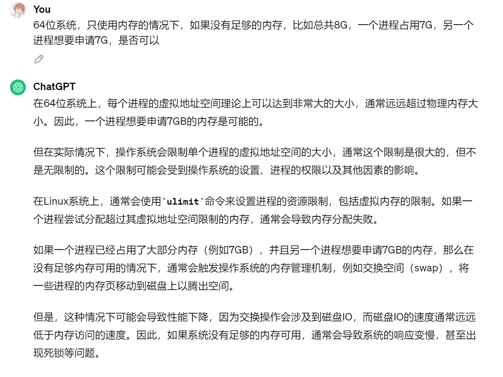
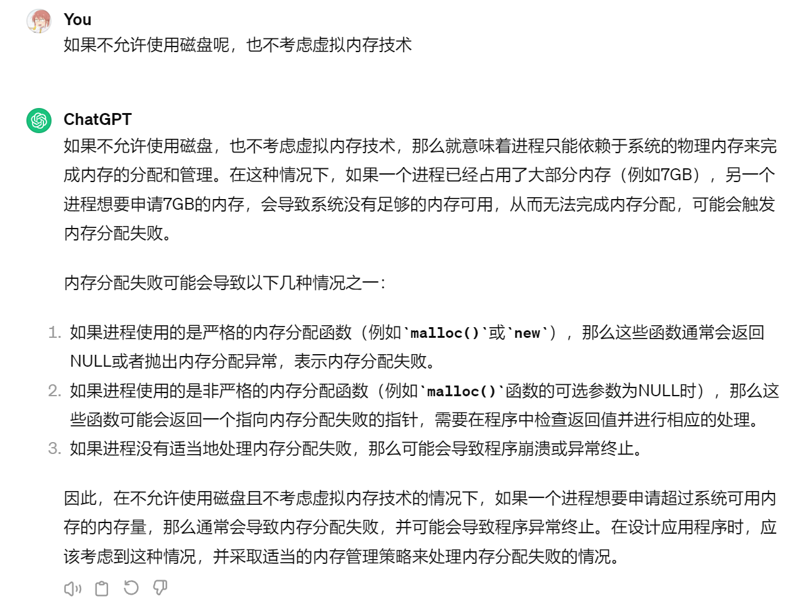

# 快手一面 数据库部门

## 操作系统场景题

- 64位系统，只使用内存的情况下，如果没有足够的内存，比如总共8G，一个进程占用7G，另一个进程想要申请7G，是否可以

  

  

- 共享的数据变量，一个进程写A，另一个读A，已知绝对时间上写A先执行，读B后执行，那么是否B一定能读取到修改后的数据

## 网络

- url到网页显示的过程

## 算法题

- 计算string中的数学表达式“1+3*5/2-6”的结果

  > 两个栈，一个存储数字，一个存储符号，+-进栈前考虑要不要先算完栈内的乘法和除法，计算乘法和除法的时候要注意把栈里的数字和运算符
  >
  > 逆序读取s进行计算最好，这样可以直接正序计算

