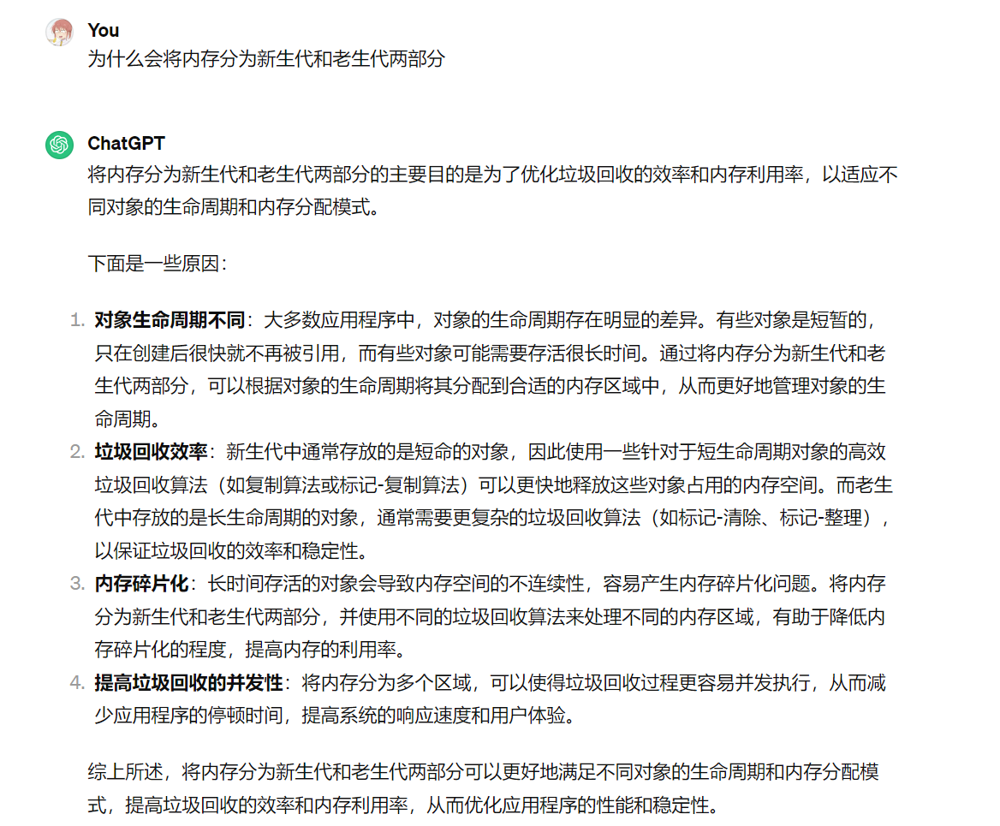

# 蚂蚁一面 国际事业部

## 网络

- 进程间通信除了使用https可以用什么？（不懂在问什么）

  > socket:udp, tcp, 本地

- session和cookie的区别

  

- https的整体流程

- get 和 post

## Java

- gc过程

- 如果新生代时间为0，老生代会出现什么问题，为什么要分开做gc处理，不同算法做gc的意义是什么

  

- 观察者模式

  

  

  

- hashmap线程安全性，存储结构

- 红黑树

  > 1、叶子和根黑色
  >
  > 2、不存在相连的红色节点
  >
  > 3、任意节点到其子节点路径上黑色节点数量相等
  >
  > 4、优点：调整策略相对简单，因为只要保证不存在连续的红色节点，就可以保持树的平衡

- syncronized 底层实现

  > 对象头中的锁标识，0代表能获取，1代表不能获取；moniterenter，moniterexit
  >
  > 

## 项目

- 为什么用消息队列，为什么用redis stream，mq和kafka之间选型
- 直接对异步处理的消息加分布式锁为什么不行

## 扩展

- AR进行物品的货币价格转换