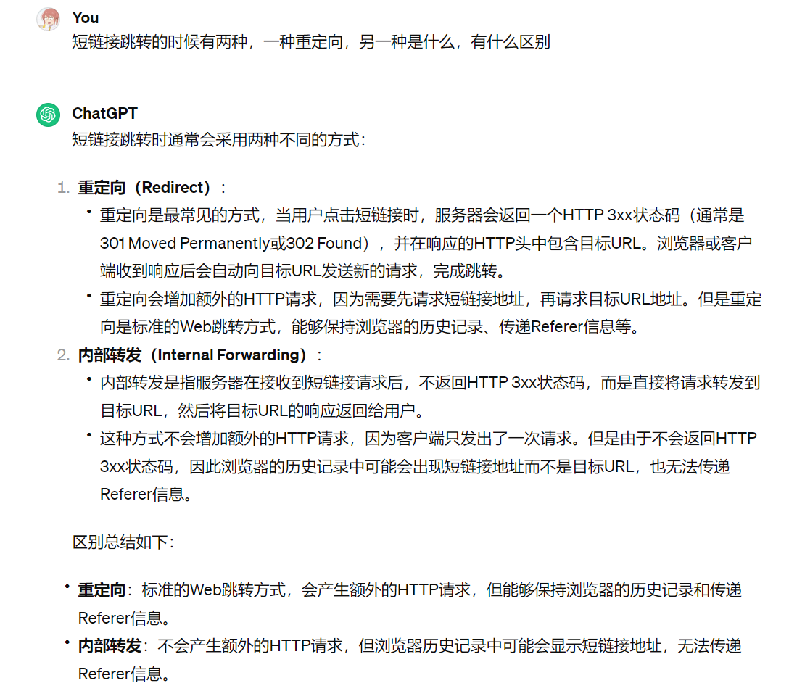

# 美团一面- Saas 部门

## 项目

- 如果出现 redis 波动，想要绕过 redis 直达 mysql 提供服务，怎么办

  

- 有大量的生成短链接怎么办，如果想要解决有什么实现方式

  

- xr视频会议的应用场景

- murmurhash有没有了解过这个算法具体的细节

- 如果短链接生成重复，是直接报错还是重复生成，生成几次

  > 重复尝试10次，之后报错

- 短链接跳转的时候有两种，一种重定向，另一种是什么，有什么区别，浏览器显示的是短连接地址还是原始链接地址

  

## MySQL

- 写出mysql存储结构的一些值，id，gid，shortlink，originallink等

- 索引存储在哪

  > 由于数据库的索引是保存到磁盘上的，因此当我们通过索引查找某行数据的时候，就需要先从磁盘读取索引到内存，再通过索引从磁盘中找到某行数据，然后读入到内存，也就是说查询过程中会发生多次磁盘 I/O，而磁盘 I/O 次数越多，所消耗的时间也就越大。

- 查询语句查询在某段日期之间的记录特别慢，有什么手段优化

- 写一个查询语句查询在某段日期之间的记录，分页查询

  
  
  

## Java

- ArrayList底层是什么实现的，add操作如何实现，怎么扩容

  
  
- 访问arraylist[0]位置的元素如果不存在会怎么样，抛什么异常

  > NullPointerException 空指针错误异常，如果访问l[2], l[2]根本不存在，只有l[0]和l[1]，抛出数组越界异常，如果访问的l[2]是null，则是空指针错误异常

## Spring

- spring的注解用过吗，是用什么实现的

  

## 算法

- List中有很多数据，查询createtime最靠前的一条
