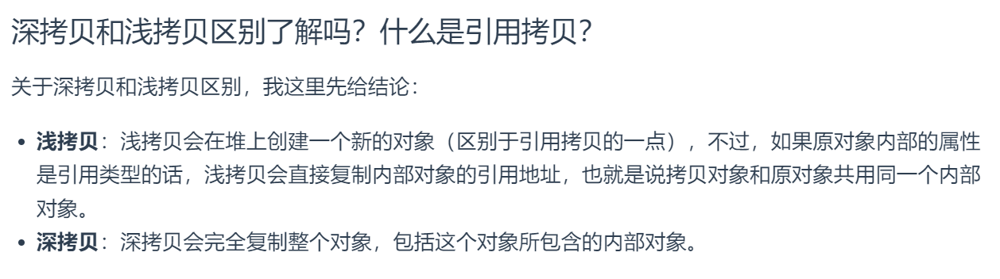
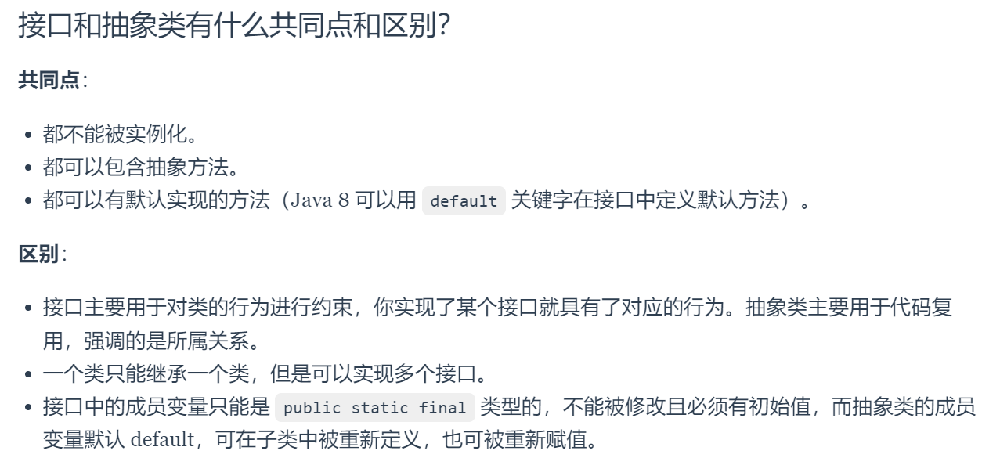

# 美团一面- Saas 部门

## Java

- 集合有哪些

- Set 和 List 的区别

- 深拷贝和浅拷贝

  

- 抽象类和接口的区别

  

- 并发线程有什么问题，一般如何解决

- 创建线程的方法，线程池

- java内存模型

  

## 数据结构

- 链表与数组
- 红黑树和平衡二叉树具体复杂度理解

## 网络

- https
- osi7层作用
- 对称加密和非对称加密

## 算法

- 三数之和

  > 确定i后双指针，注意jk去重