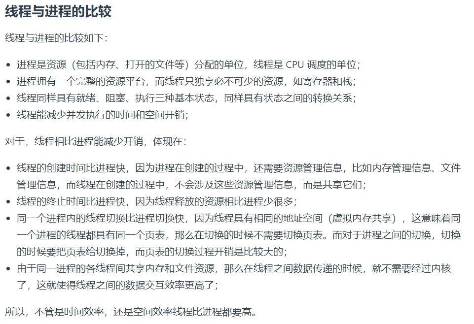
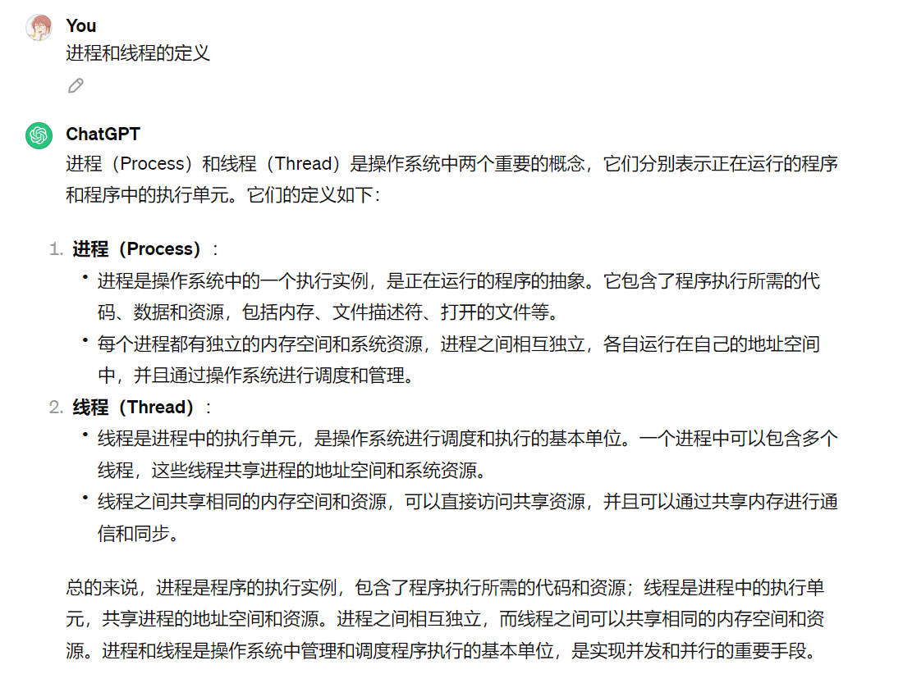
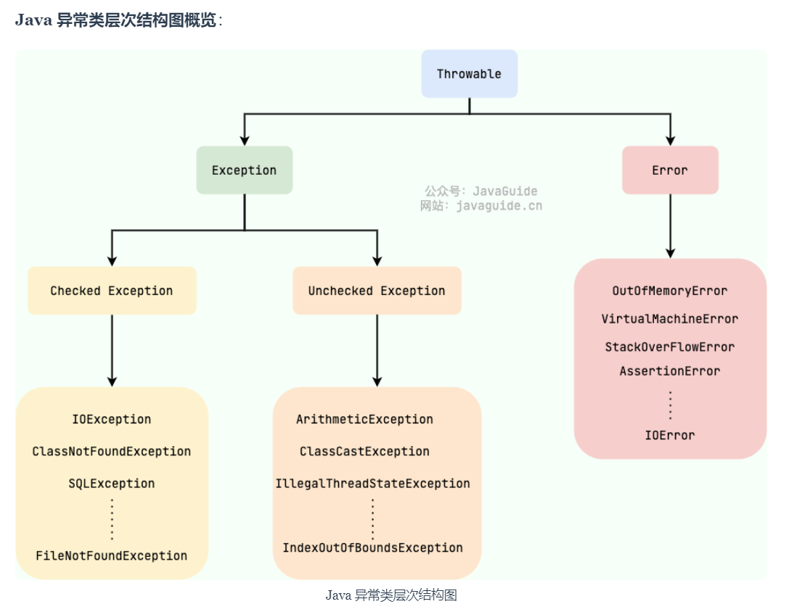
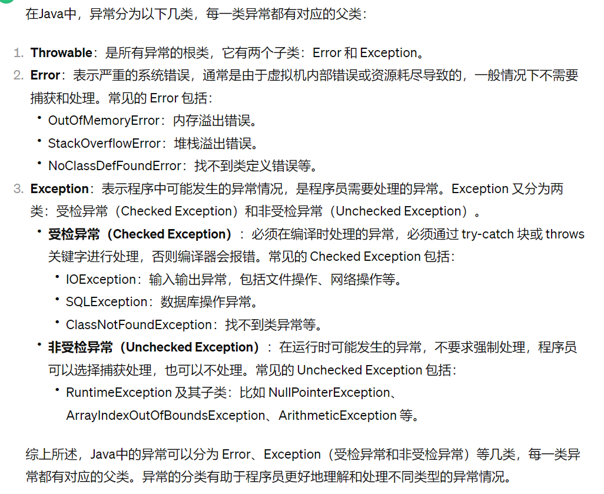
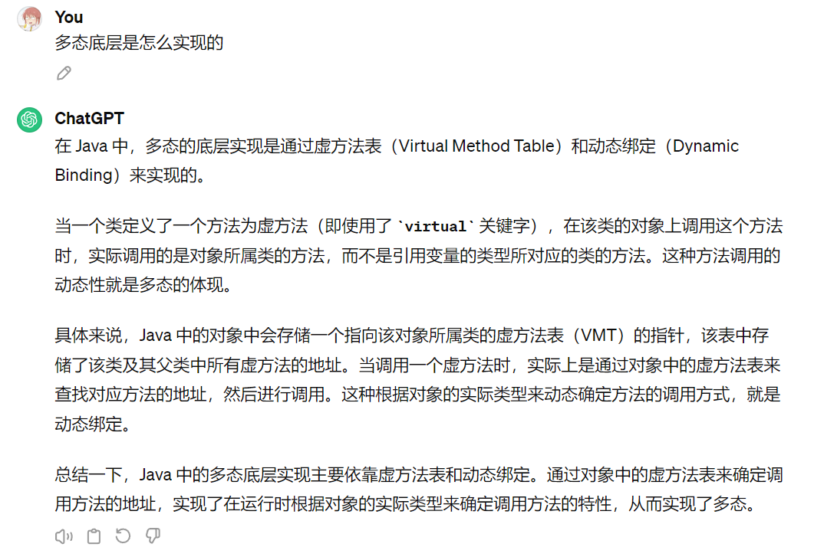
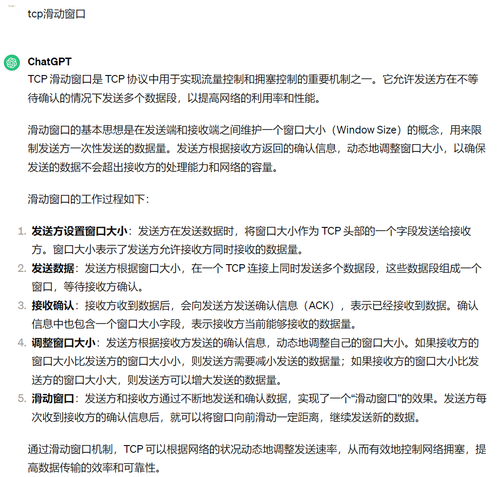

# 淘天-淘工厂一面

## 项目

- 场景：微信里无法跳转短链接，针对域名做屏蔽怎么办

- 项目里索引用了哪些

  > 基本信息表里是用短链接做唯一索引
  >
  > 记录pv，uv，uid的监控信息表，用短链接+gid+日期+小时作唯一联合索引

- 跳转的域名是如何考虑的

## 操作系统

- 进程和线程的区别

  

  

## Java

- 异常有哪些

  

  

- 设计模式介绍

- 多态底层是什么

  

## 网络

- tcp滑动窗口

  
- tcp和udp区别