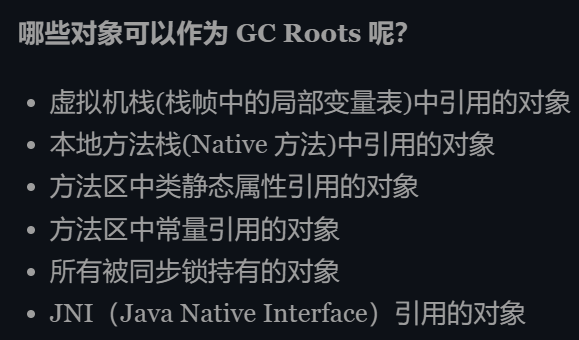

# 算法题
+ L0 L1 L2....Ln链表变化成L0 Ln L1 Ln-1... 要求空间O(n)
> 思路：将后半链表进行反转
# 八股
+ ​关系型数据库和非关系型数据库的差别，以及常用于什么业务
+ ​jvm垃圾回收算法有哪些 怎么用于新生代和老生代
+ ​怎么判断是否要被垃圾回收 
+ ​哪些内容可以作为gc root对象

+ ​redis哪些常用数据结构，一般用于什么
+ ​zset怎么实现的，存了10000个数的zset会查询多少次
+ 进程线程和协程的特点以及区别
> 协程是更轻量化的线程，是一个可以在某个地方挂起的特殊函数，常见于go语言
+ ​索引有哪几种
+ ​b树和b+树特点以及区别，单点查询时b树和b+树的性能差别
+ ​索引的优化 
+ ​为什么不能用区分度不高的索引，在一个性别比例均衡的场景下，如果用性别当索引，一次就能筛去一半的人，为什么不可行
> 回表查询的IO消耗比索引慢很多
+ 死锁的四个条件
+ 进程通信方法