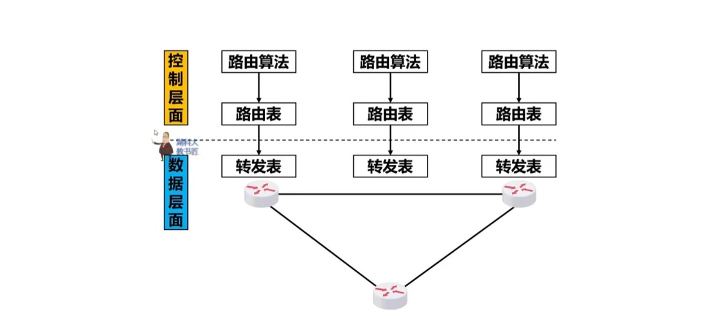
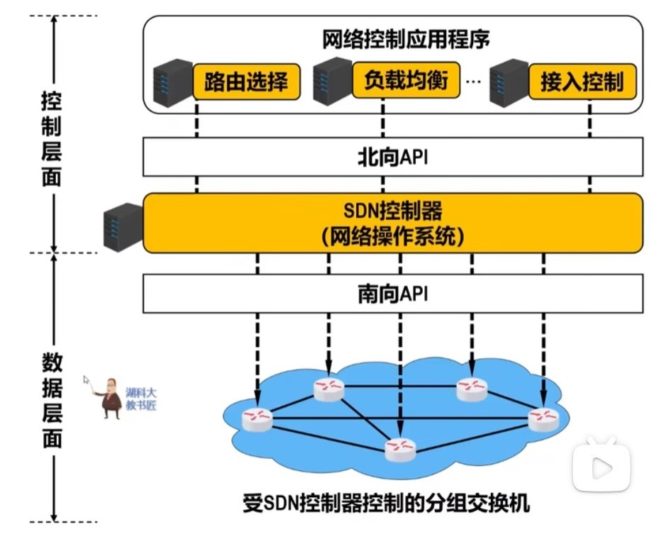

# 计算机网络

## HTTP

[相关面试题](https://xiaolincoding.com/network/2_http/http_interview.html#http-%E5%9F%BA%E6%9C%AC%E6%A6%82%E5%BF%B5)

### http和https的区别

1. 明文传输，安全性较差，另一个传输数据加密，安全性较好
2. 使用https协议需要到CA申请证书
3. HTTP响应速度比HTTPS速度快，因为还需要加上ssh握手的消耗
4. 端口不同，一个40，一个443
5. HTTPS更消耗服务器资源（处理SSL/TLS协议）

### http的常见字段

1. Host：用来指定服务器的域名
2. Content-Length：response body的数据长度，用于解决TCP粘包问题（区分字节流的边界）
3. connection：HTTP长连接机制
4. content-Type：本次数据是什么格式

### HTTP缓存技术

[强制缓存和协商缓存](https://xiaolincoding.com/network/2_http/http_interview.html#http-%E7%BC%93%E5%AD%98%E6%8A%80%E6%9C%AF)

强制缓存：response头部字段expires（绝对时间），cache-control（相对时间）

协商缓存：强制缓存超时如果第一次返回的response存在相关字段，就再发送request带上相关字段

第一次请求返回的response：last-modified，Etag

如果强制缓存过期，发现当前response中含有以上字段：request包包含if-modified-since，if-none-match字段

### HTTPS建立连接的过程？

SSL/TLS协议基本流程：

* 客户端向服务器索要并验证服务器的公钥
* 双方协商产生 `通信密钥`
* 双方采用 `通信密钥`来进行加密通信

## TCP/UDP

### 什么是TCP？

三大特点：面向连接，可靠的，基于字节流

建立一个TCP连接需要客户端与服务端达成三个共识：

1. socket（IP地址和端口）
2. 序列号（解决乱序问题）
3. 窗口大小（流量控制）

### TCP如何保证可靠传输？

1. 效验和字段（检测传输过程中TCP的头部和数据有没有改变）
2. 序列号/确认号
3. 三次握手/四次挥手
4. 超时重传/快速重传
5. 流量控制/拥塞控制

### TCP和UDP的区别

1. 是否面向连接
2. 可靠性不同
3. 拥塞和流量控制
4. 报文头开销不同（TCP稳定头部20字节，可扩张，UDP只有8字节头部）
5. 传输方式（流式传输）
6. 分片方式（TCP在传输层按照MSS分段（也就是TCP数据的最大容量），UDP在IP层按照MTU（1500字节）分片）

MTU：max transmission unit

MSS：max segment size

### 为什么是三次握手？不是两次握手？

1. 三次握手主要是为了确定两方的收发能力是否正常

不两次握手的原因：避免历史连接问题（RST位，强制中断连接）

2. 确认双方的序列号

### TCP中TIME_WAIT状态的时间为什么是2MSL？

MSL：message segment lifetime 报文段最大生存时间

TTL：time to live 数据包进过一个路由器时，可传递的最大距离（经过一个路由器ttl-1）

一来一回，总共2MSL时间，**足以让两个方向上的数据包都被丢弃，使得原来连接的数据包在网络中都自然消失，再出现的数据包一定都是新建立连接所产生的**

同时至少允许最后一个ACK包丢失一次

linux **MSL为30s，TTL为64跳**

### 为什么需要TIME_WAIT？

### TCP重传、滑动窗口、流量控制、拥塞控制

#### TCP重传

##### 超时重传

RTT（round-trip time）往返时延

RTO（retransmission timeout）超时重传时间

##### 快速重传

接收端发现有一个seq=2没有，剩下每来一个seq=3，4，5就返回之前seq的ACK（ack=2），发送端接收三个相同ACK（ack=2）后就重传之前没发过去的seq（seq=2），最后接收端都收到了就发送一个ACK（ack=6）,表明2，3，4，5都收到了

##### SACK&DSACK

相当于发送ACK的同时还发送自己已经接收到的数据大小

#### 滑动窗口与流量控制

避免发送方的数据填满接受方的内存

#### 拥塞控制

* 慢启动（指数）
* 拥塞避免（线性）
* 拥塞发生（采用超时重传或快速重传）
* 快速恢复

## IP

### DNS解析步骤

[DNS解析](https://www.sfn.cn/news/technology/detail/222.html?navId=22)

知道url获取IP地址

### 数据包在网络中的心路历程

[数据包的心路历程](https://cloud.tencent.com/developer/article/1607505)

传输层：segment 段

IP层：package 数据包

数据链路层：帧

注意这么几个点：网关，路由器，交换机（MAC和端口号），网卡（有网卡的都有IP地址和MAC），

路由表（包含目标地址，子网掩码，网关，网卡接口，跃点数）

最关键的是NAT网络地址转换技术（公有IP和私有IP）

### 路由协议

RIP，OSPF，ISP（Internet Service Provider（互联网服务提供商））内/ISP外 BGP（边界网关协议）等

## NAT(Network Address Translation)

### 网络地址转换

**SNAT，DNAT：**source（destination） network address translation源地址转换，NAT设备将发送的IP包中的source IP从私有IP地址改为公有IP地址，然后NAT设备留下一个Track table，记录私有IP和公有IP的对应关系。

**NAPT：**network address port translation 网络地址端口转换。

### 内网穿透是什么

使用NAT上网前提是局域网机器主动请求广域网的IP，然后才可以将内网的IP和端口转换为外网的IP和端口。

但是反过来公网的机器想主动请求内网机器，就会被NAT路由器拦截，因为NAT里面没有相关的IP端口的映射记录，就不会转发数据。

**关键是要给NAT网关一个内网和外网的IP端口映射记录**

### 阿里云产品NAT网关

分为公网NAT网关和私网NAT网关（也就是VPS virtual private service）

VPC（virtual private cloud）虚拟私有云，和SDN的思想相似，为每一位用户抽象出一个二层网络

公网NAT网关关键为提供NAT代理功能（SNAT和DNAT）

每个城市之间默认网是不通的

流程：申请公网NAT网关——申请私网ECS（Elastic Compute Service弹性计算服务）——创建SNAT规则——创建DNAT规则

**申请公网NAT网关：**提供一个渠道来让私网访问公网/公网访问私网

**申请私网ECS：**默认没有分配公网IP，所以ping不通外网地址，但是创建私网ECS的理由是有时候企业内部使用这些资源，不需要公开

**创建SNAT规则：**也就是给与私网ECS访问外网的能力

**创建DNAT规则：**给与外网访问私网ECS的能力（实际上使用的技术也用到了NAPT技术，也会自定义的映射端口）

## SDN

software define networks，软件定义网络

谷歌建立的数据中心网络B4使用了软件定义网络的信息

[SDN了解视频](https://www.bilibili.com/video/BV15L411E7eE/?spm_id_from=333.337.search-card.all.click&vd_source=5efe404d4d5f7e0b29922cf5d10361bc)

### 传统路由器的功能

三层网络设备，支持到网络层，数据链路层，物理层（二层是交换机，只支持数据链路层和物理层）

1. 为主机间的通信提供转发服务（路由表）
2. 路由选择，有多条路径路由器会选择一条合适的路径

### 路由器之间传送的信息

1. 主机间交互的信息
2. 路由信息

路由表就是三层网络设备中的路由表

转发表是MAC地址表，记录MAC地址和相关转发端口信息

### SDN核心思想

网络的**控制层面**和**数据层面**分离，让**控制层面**利用软件来控制**数据层面**的设备

### OpenFlow协议

南向接口，也就是控制层面和数据层面之间的接口

openflow协议可以使得控制层面的控制器可以对数据层面的物理设备进行直接控制

### SDN中的广义转发

传统意义上的数据层面只是根据相关的MAC地址从而匹配端口号来进行转发分组

**匹配：**通过MAC地址来进行匹配

**转发：**通过匹配的MAC地址对应的端口号进行转发

SDN广义转发：

**匹配：**对网络体系中各层（数据链路层、网络层、传输层）首部的字段进行匹配

**执行动作：**不但可以转发分组，还可以**负载均衡**、**重写IP首部**（类似于NAT路由器中的地址转换，私有IP到公有IP）、人为阻挡一些分组（数据包），就像防火墙一样

所以此时完成匹配到转发这个设备并不局限在网络层工作（三层设备），所以不再称为路由器，而是**openflow交换机**或者直接称为交换机

所以此时取代转发表的是流表（flow table）

### 流表内容

flow table

一个流穿过网络的一种分组序列，每个分组都**共享分组首部的某些字段的值**

刘表通过SDN远程控制器进行管理（也就是控制层面）

流表有三个内容：

**首部字段值：**做匹配用的，此时可以匹配多层网络协议中的头部字段

计数器：1. 记录已经与该流表项匹配的分组数量的计数器 2. 记录该流表项上次更新到现在经历时间的计数器

**动作：**分组匹配某个流表项时，执行匹配的动作（分组转发到指明端口、丢失分组、重写首部字段等）

### SDN体系结构和四个关键特征

1. 基于流的转发（转发可以基于多种网络协议的首部字段进行转发，与传统IP协议仅根据目的IP地址进行转发的方式不同）
2. 数据层面与控制层面分离（原来数据层面和控制层面在一个交换机中，由每个交换机决定采用什么样的路由方式，相当于集成了）
3. 位于数据层面openflow交换机之外的网络控制功能（网络控制是由各种网络控制软件来实现的）
4. 可编程的网络
