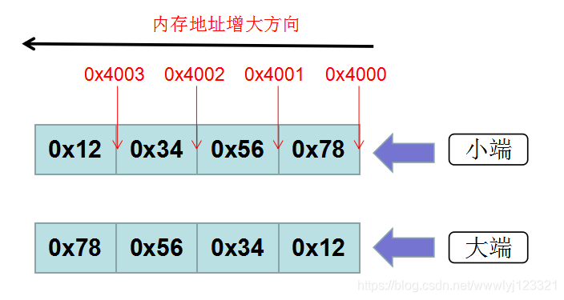

# 阿里云云网络

地点：南京

主要工作：做NAT网关相关工作

主要语言：控制面：JAVA,转换面：C/C++ 运维：python，监控：Golang

## 计算机网络

1. TCP和UDP的区别
2. 网络字节序和主机字节序



```
主机字节序：在用户主机上存储多Byte数据使用大端存储还是小段存储
网络字节序：所有在网络传输的多字节整数使用大端序编码（数据包就是01串，保证这个01串种多字节整数的排布是大端序编码）
```

## 操作系统

1. 操作系统大小端
